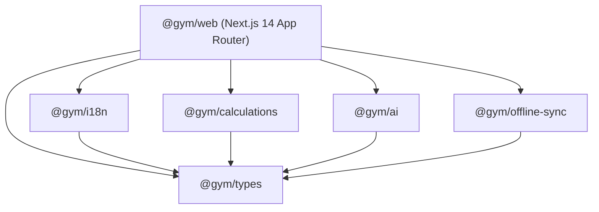

# Informe de Calidad de Código y Deuda Técnica (CODE_QUALITY_REPORT.md)

**Proyecto:** GYM PROGRESS / gymcorleone  
**Fecha:** 17 de Septiembre, 2026  
**Áreas Evaluadas:** TypeScript Static Analysis, Arquitectura Monorepo, Acoplamiento de Dependencias, Calidad y Mantenibilidad del Código Fuente.

---

## 1. Resumen Ejecutivo de Salud del Código

| Dimensión | Calificación | Estado | Observaciones |
|---|:---:|:---:|---|
| **Tipado Estático (TypeScript)** | **A** | **Excelente** | `tsc --noEmit` pasa con 0 errores en `apps/web`. Tipos fuertemente definidos en `@gym/types`. |
| **Arquitectura de Monorepo** | **A-** | **Muy Buena** | Separación modular limpia con npm workspaces (`apps/*`, `packages/*`). |
| **Linters & Formateo** | **C** | **Mejorable** | Ausencia de `.eslintrc` y `.prettierrc` compartidos en la raíz del repositorio. |
| **Higiene de Dependencias** | **B+** | **Buena** | Imports directos y tipados; sin ciclos de importación detectados. |
| **Deuda Técnica Acumulada** | **B** | **Moderada** | Persistencia acoplada a `localStorage`, ausencia de Error Boundary. |

---

## 2. Análisis Estático de TypeScript (`tsc --noEmit`)

Se ejecutó la verificación formal del compilador TypeScript sobre la aplicación web principal:

```bash
rtk npx tsc --noEmit (en apps/web)
# Salida: TypeScript: No errors found.
```

### Fortalezas del Sistema de Tipos:
1. **Paquete Central `@gym/types`:**
   Todos los modelos de dominio centrales (`Exercise`, `WorkoutSession`, `SetLog`, `MachineInspection`, `BodyMeasurement`, `PersonalRecord`) están centralizados y exportados.
2. **Eliminación de `any` Implícitos:**
   `tsconfig.json` cuenta con `"strict": true` y `"noImplicitAny": true`, lo que garantiza que los parámetros de funciones y retornos posean tipos explícitos o inferidos de forma segura.
3. **Manejo Seguro de Nulos:**
   Los campos opcionales (`nameEs?`, `instructionsEs?`, `secondaryMusclesEs?`) se comprueban sistemáticamente con encadenamiento opcional (`?.`) y operadores de coalescencia nula (`??`).

### Áreas de Mejora en Tipado:
- **Casting Inseguro en Eventos DOM:**
  En `ExerciseCatalogView.tsx` y `ActiveWorkoutView.tsx`, se detectaron casts manuales como:
  ```typescript
  onError={(e) => { (e.target as HTMLElement).style.display = 'none'; }}
  ```
  *Sugerencia:* Utilizar un tipo más específico como `React.SyntheticEvent<HTMLImageElement, Event>`.
- **Deserialización de `localStorage`:**
  Las funciones que leen del almacenamiento local realizan `JSON.parse(stored)` con type assertion directa `as WorkoutSession[]` sin validación en tiempo de ejecución (Run-time Schema Validation con Zod o Valibot). Si el esquema evoluciona o se corrompe en el navegador del cliente, los componentes fallarán en cascada.

---

## 3. Estructura y Dependencias del Monorepo



### Evaluación Modular:
- **Acoplamiento:** **Bajo y unidireccional.** Las capas de lógica pura (`@gym/calculations`, `@gym/i18n`) no tienen dependencias hacia la capa de presentación (`@gym/web`), lo que permite reutilizarlas en aplicaciones móviles nativas (React Native / Expo) sin reescribir código.
- **Transpilación:** Las dependencias del monorepo se integran fluidamente mediante `transpilePackages: ['@gym/types', '@gym/i18n', '@gym/calculations', '@gym/ai', '@gym/offline-sync']` en `next.config.mjs`.

---

## 4. Análisis de Código Muerto y Huérfano

1. **Test Huérfano en Cálculos (BUG-011):**
   El archivo `packages/calculations/tests/calculations.test.js` contiene un `require` roto que apunta a `./packages/calculations/src/index.ts` en lugar de `../src/index.ts`. No está conectado al comando `npm test` principal.
2. **Utilidades del Escáner de IA:**
   El archivo `packages/ai/src/index.ts` contiene definiciones de contratos para modelos de visión multimodal (OpenAI GPT-4o / Gemini Vision) y detección OCR que actualmente están mockeados en la interfaz de usuario para permitir el funcionamiento offline.

---

## 5. Deuda Técnica Priorizada

| Ítem de Deuda Técnica | Impacto | Esfuerzo de Refactor | Riesgo Si No Se Atiende |
|---|:---:|:---:|---|
| **Falta de Error Boundary (`error.tsx`)** | Crítico | 30 min | White screens irrecuperables en producción |
| **Ausencia de Zod en deserialización de LocalStorage** | Alto | 1-2 horas | Fallos silenciosos ante cambios de esquema |
| **Capa de Almacenamiento Acoplada a LocalStorage** | Medio | 3-4 horas | Bloqueo por cuota de 5MB en fotos de progreso |
| **Falta de ESLint / Prettier en Monorepo** | Medio | 1 hora | Inconsistencias de estilo entre desarrolladores |
| **Corrección de Runner de Tests en Monorepo** | Bajo | 15 min | Tests unitarios aislados no ejecutables |
