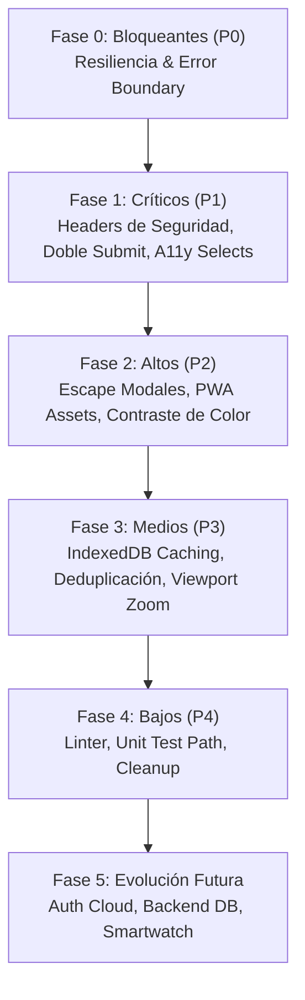

# Plan Estratégico de Corrección y Modernización (FIX_PLAN.md)

**Proyecto:** GYM PROGRESS / gymcorleone  
**Fecha:** 17 de Septiembre, 2026  
**Responsable:** Lead QA & Engineering Architect  
**Principio Rector:** Priorización basada en impacto en el usuario, mitigación de riesgos de seguridad y estabilidad en producción.

---

## Estructura de Fases de Corrección

---

## Fase 0: Defectos Bloqueantes (P0) — Acción Inmediata

| ID | Tarea / Corrección | Archivos a Modificar | Riesgo | Tiempo Est. |
|:---:|---|---|:---:|:---:|
| **BUG-002** | **Implementar Error Boundary Global en Next.js** Crear `error.tsx` y `global-error.tsx` en `apps/web/src/app`. Si un dato de sesión en LocalStorage es inválido, atrapar el error, registrarlo y mostrar una pantalla amigable con botón de "Recuperar Sesión / Ir al Inicio" en lugar de congelar la app en una pantalla blanca irrecuperable. | [`apps/web/src/app/error.tsx`](file:///c:/Users/Mario%20Castro/Documents/antigravity/blissful-galileo/apps/web/src/app/error.tsx) [`apps/web/src/app/global-error.tsx`](file:///c:/Users/Mario%20Castro/Documents/antigravity/blissful-galileo/apps/web/src/app/global-error.tsx) | Muy Bajo | 30 min |

---

## Fase 1: Defectos Críticos (P1) — Seguridad y Funcionalidad Mayor

| ID | Tarea / Corrección | Archivos a Modificar | Riesgo | Tiempo Est. |
|:---:|---|---|:---:|:---:|
| **BUG-001** | **Inyección de Cabeceras de Seguridad HTTP en Vercel/Next.js** Configurar `headers()` en `next.config.mjs` con CSP, `X-Frame-Options: DENY`, `X-Content-Type-Options: nosniff`, `Referrer-Policy: strict-origin-when-cross-origin` y `Permissions-Policy`. | [`apps/web/next.config.mjs`](file:///c:/Users/Mario%20Castro/Documents/antigravity/blissful-galileo/apps/web/next.config.mjs) | Bajo | 20 min |
| **BUG-003** | **Prevención de Doble Envío en Finalización de Entrenamiento** Introducir bandera de estado asíncrono `isFinishing` en `ActiveWorkoutView.tsx`. Al hacer clic en "Guardar y Salir", deshabilitar inmediatamente el botón y aplicar debounce para evitar la duplicación de sesiones en el historial. | [`ActiveWorkoutView.tsx`](file:///c:/Users/Mario%20Castro/Documents/antigravity/blissful-galileo/apps/web/src/components/workout/ActiveWorkoutView.tsx) | Bajo | 20 min |
| **BUG-004** | **Corrección de Nombre Accesible en Elementos `<select>` (WCAG A)** Añadir atributos `aria-label` descriptivos a los selectores de gimnasio activo en el Dashboard y selector de esfuerzo RIR en el entrenamiento activo. | [`DashboardView.tsx`](file:///c:/Users/Mario%20Castro/Documents/antigravity/blissful-galileo/apps/web/src/components/dashboard/DashboardView.tsx) [`ActiveWorkoutView.tsx`](file:///c:/Users/Mario%20Castro/Documents/antigravity/blissful-galileo/apps/web/src/components/workout/ActiveWorkoutView.tsx) | Muy Bajo | 15 min |

---

## Fase 2: Defectos Altos (P2) — Accesibilidad, UX y Assets Rotos

| ID | Tarea / Corrección | Archivos a Modificar | Riesgo | Tiempo Est. |
|:---:|---|---|:---:|:---:|
| **BUG-005** | **Habilitar Despacho por Tecla `Escape` y Clic en Fondo en Modales** Agregar listener de teclado `Escape` y clic en backdrop en `RestTimerModal.tsx` y `ExerciseCatalogView.tsx` (detalle de ejercicio) para cumplir con el patrón de diálogo accesible WAI-ARIA. | [`RestTimerModal.tsx`](file:///c:/Users/Mario%20Castro/Documents/antigravity/blissful-galileo/apps/web/src/components/workout/RestTimerModal.tsx) [`ExerciseCatalogView.tsx`](file:///c:/Users/Mario%20Castro/Documents/antigravity/blissful-galileo/apps/web/src/components/exercises/ExerciseCatalogView.tsx) | Bajo | 25 min |
| **BUG-006** | **Creación de Assets Faltantes de Iconos PWA (404)** Generar y ubicar en `apps/web/public/data/` las imágenes `icon-192.png` e `icon-512.png` con la identidad visual corporativa de Gym Progress. | `apps/web/public/data/icon-192.png` `apps/web/public/data/icon-512.png` | Cero | 15 min |
| **BUG-007** | **Ajuste de Paleta de Colores para Cumplimiento WCAG AA Contrast** Modificar clases de Tailwind de `text-gray-400` a `text-gray-600` en subtítulos de KPIs del Dashboard y ajustar el acento anaranjado `#D83B01` a `#C43100` sobre fondos blancos. | [`DashboardView.tsx`](file:///c:/Users/Mario%20Castro/Documents/antigravity/blissful-galileo/apps/web/src/components/dashboard/DashboardView.tsx) [`tailwind.config.ts`](file:///c:/Users/Mario%20Castro/Documents/antigravity/blissful-galileo/apps/web/tailwind.config.ts) | Bajo | 20 min |

---

## Fase 3: Defectos Medios (P3) — Rendimiento, Datos y Ergonomía

| ID | Tarea / Corrección | Archivos a Modificar | Riesgo | Tiempo Est. |
|:---:|---|---|:---:|:---:|
| **BUG-008** | **Restauración de Escalabilidad y Zoom en Viewport** Modificar `layout.tsx` eliminando `userScalable: false` y `maximumScale: 1` para permitir zoom accesible a usuarios con problemas de visión. | [`layout.tsx`](file:///c:/Users/Mario%20Castro/Documents/antigravity/blissful-galileo/apps/web/src/app/layout.tsx) | Bajo | 5 min |
| **BUG-009** | **Deduplicación de Equipos al Guardar desde Escáner IA** En `ScannerView.tsx`, verificar si el modelo de máquina identificado ya existe en la lista de equipos del gimnasio activo antes de agregar un nuevo registro duplicado. | [`ScannerView.tsx`](file:///c:/Users/Mario%20Castro/Documents/antigravity/blissful-galileo/apps/web/src/components/scanner/ScannerView.tsx) | Bajo | 20 min |
| **BUG-010** | **Caché en IndexedDB para Catálogo de Ejercicios (6.2MB)** Integrar `idb-keyval` para persistir los 1,324 ejercicios tras la primera descarga, evitando que el usuario vuelva a consumir datos en sesiones posteriores. | [`ExerciseCatalogView.tsx`](file:///c:/Users/Mario%20Castro/Documents/antigravity/blissful-galileo/apps/web/src/components/exercises/ExerciseCatalogView.tsx) | Medio | 45 min |

---

## Fase 4: Defectos Bajos (P4) — Testing, Limpieza y Mantenimiento

| ID | Tarea / Corrección | Archivos a Modificar | Riesgo | Tiempo Est. |
|:---:|---|---|:---:|:---:|
| **BUG-011** | **Corrección de Importación en Tests Unitarios de Cálculos** Modificar `packages/calculations/tests/calculations.test.js` para importar con `../src/index.ts` y añadir script `"test"` al paquete y comando monorepo. | [`packages/calculations/tests/calculations.test.js`](file:///c:/Users/Mario%20Castro/Documents/antigravity/blissful-galileo/packages/calculations/tests/calculations.test.js) [`packages/calculations/package.json`](file:///c:/Users/Mario%20Castro/Documents/antigravity/blissful-galileo/packages/calculations/package.json) | Cero | 10 min |
| **BUG-012** | **Compresión de Imágenes de Progreso Físico en Base64** Incorporar compresión en canvas antes de guardar fotos en el historial corporal para proteger la cuota de 5MB de LocalStorage. | [`ProgressView.tsx`](file:///c:/Users/Mario%20Castro/Documents/antigravity/blissful-galileo/apps/web/src/components/progress/ProgressView.tsx) | Bajo | 30 min |
| **AUD-01** | **Configuración de Linter y CI Automático** Agregar `.eslintrc.json` y pipeline de GitHub Actions (`.github/workflows/ci.yml`) ejecutando typecheck, tests y auditoría de seguridad. | `.github/workflows/ci.yml` `.eslintrc.json` | Cero | 40 min |

---

## Fase 5: Evolución y Arquitectura Futura (Roadmap)

1. **Backend Serverless Multi-Inquilino (Cloud DB):**
   - Migrar el almacenamiento local a **Supabase (PostgreSQL) o Firebase Firestore** con autenticación segura por correo, Google y Apple ID.
   - Sincronización en segundo plano con estrategia Offline-First (Local-First con CRDTs o replicación diferida).
2. **Integración con Hardware y Smartwatch:**
   - Desarrollo de la aplicación complementaria para **Apple Watch (WatchOS) y Wear OS**: visualización de tiempos de descanso en la muñeca y pulsómetro en vivo sincronizado con la sesión activa.
3. **Visión Artificial con Cámara en Tiempo Real:**
   - Conexión del módulo de Escáner IA con la cámara nativa del teléfono móvil a través de `navigator.mediaDevices.getUserMedia`, permitiendo captura instantánea y detección en el borde con modelos ONNX / TensorFlow.js o API multimodal de baja latencia.
